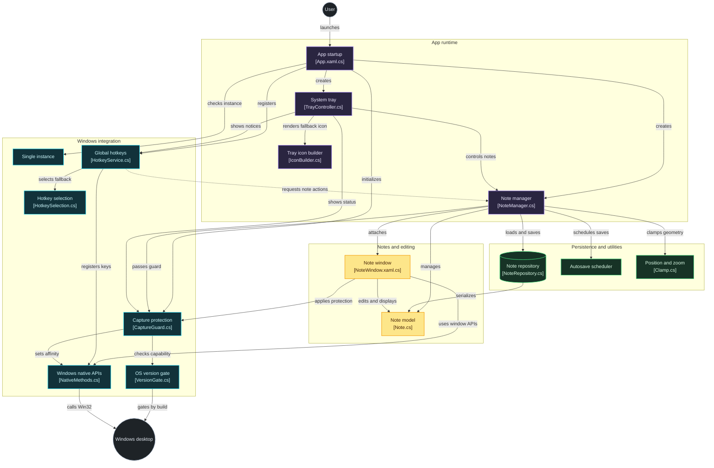

<p align="center">
  <a href="GhostNotes.svg"></a>
</p>

<h1 align="center">GhostNotes</h1>

<p align="center">
  <b>Ultra-lightweight, OBS-invisible floating sticky notes for Windows 10 & 11.</b>
</p>

<p align="center">
  Keep private stream notes, meeting prompts, checklists, and scratchpads on your screen during live broadcasts, video calls, or screen recordings, without your audience ever seeing them.
</p>

<p align="center">
  <a href="https://github.com/ezykl/GhostNotes/releases"></a>
  <a href="https://github.com/ezykl/GhostNotes/releases"></a>
  <a href="LICENSE"></a>
</p>

<p align="center">
  <a href="https://github.com/ezykl/GhostNotes/releases"><b>⬇️ Download GhostNotes (v1.0.0)</b></a><br>
  <i>No installation or .NET runtime needed. Just download and run.</i>
</p>

---

## 👻 What is GhostNotes?

GhostNotes puts sticky notes on your screen that **only you can see**. They float above your windows like normal notes, but screen capture tools simply don't pick them up. Your talking points, scripts, and reminders stay in view while your stream, recording, or screen share stays clean.

**Works with:** OBS Studio · Streamlabs · Discord · Zoom · Google Meet · Microsoft Teams · screenshot tools

---

## ✨ Features

- **🛡️ 100% Screen-Capture Invisible (OBS Stealth)**
  Uses Windows DWM Hardware Capture Exclusion (`WDA_EXCLUDEFROMCAPTURE`). Notes remain crystal-clear on your physical monitor, but are completely hidden from OBS Studio, Streamlabs, Discord screen share, Zoom, Google Meet, Microsoft Teams, and screenshot tools.
- **📌 Collapsible Edge Pill**
  Click the **—** button on any note to collapse it into a discreet edge pill docked against your monitor border. Hovering expands a preview; clicking restores the note to its exact previous position.
- **✍️ In-Place Rich Text Editing**
  Click anywhere and type. Hover near the bottom edge of any note to reveal the formatting capsule: Bold, Italic, Underline, Strikethrough, Bullet lists, Numbered lists, and Checkboxes (`- [ ]`).
- **🎨 Pastel Colors & Glass Opacity**
  Click the gear **⚙** button to choose from 6 soft pastel tints, high-contrast font colors, and smooth transparency control (20% to 100%).
- **💾 Automatic Instant Autosave**
  Every keystroke and position change is safely autosaved to `%APPDATA%\GhostNotes\notes` in the background.
- **🔔 System Tray & Windows Startup**
  Manage active/closed notes, monitor capture status, and toggle "Start with Windows" directly from the system tray icon.

---

## ⌨️ Shortcuts

| Shortcut                           | Context | Action                                                           |
| ---------------------------------- | ------- | ---------------------------------------------------------------- |
| **`Ctrl + Alt + N`**               | Global  | Create a new sticky note from anywhere                           |
| **`Ctrl + Alt + S`**               | Global  | Hide / reveal all notes instantly                                |
| **`Ctrl + B`** / **`I`** / **`U`** | Editor  | Bold / Italic / Underline                                        |
| **`Ctrl + N`**                     | Editor  | Create a new note                                                |
| **Drag Header**                    | Window  | Reposition note anywhere (including across multi-monitor setups) |
| **Drag Borders**                   | Window  | Resize smoothly in any direction                                 |

---

## 🚀 How to Run

1. Go to **[Releases](https://github.com/ezykl/GhostNotes/releases)**.
2. Download **`GhostNotes.exe`** (Portable single file) or **`GhostNotes-Setup.exe`** (Installer).
3. Double-click to launch!

> **Note:** Zero dependencies required. The portable app is completely self-contained and does not require .NET, Visual Studio, or administrative privileges to run.

---

## 🧠 How It Works

1. **Launch:** a single-instance guard makes sure only one GhostNotes runs at a time.
2. **Protect:** `CaptureGuard` checks that your Windows build supports capture exclusion, then applies the `WDA_EXCLUDEFROMCAPTURE` display affinity to every note window.
3. **Manage:** `NoteManager` loads saved notes, opens their windows, keeps them on-screen, and schedules autosaves.
4. **Control:** global hotkeys and the system tray talk to the note manager, so you can create or hide notes without leaving your game, slides, or call.

> 💡 The capture-exclusion API requires **Windows 10 version 2004 (build 19041) or later**. On older builds GhostNotes can't hide notes from capture, and the tray shows the capture status so you always know.

---

## 🏗️ Architecture

[](https://gitdiagram.com/ezykl/ghostnotes?utm_source=readme&utm_medium=picture)



### 📁 Project Structure

```
GhostNotes/
├── src/GhostNotes/        # WPF application
│   ├── Interop/           # CaptureGuard, NativeMethods, VersionGate
│   ├── Models/            # Note model
│   └── Services/          # Hotkeys, repository, autosave, single instance
├── tests/GhostNotes.Tests # Unit tests
├── installer/             # Setup installer
└── .github/workflows/     # CI
```

---

## 🛠️ Building from Source (Developers)

```bash
# Clone the repository
git clone https://github.com/ezykl/GhostNotes.git
cd GhostNotes

# Run directly
dotnet run --project src/GhostNotes

# Publish single-file portable executable
dotnet publish src/GhostNotes/GhostNotes.csproj -c Release -r win-x64 --self-contained -p:PublishSingleFile=true -o publish
```

---

## 📄 License

Distributed under the [MIT License](LICENSE).
